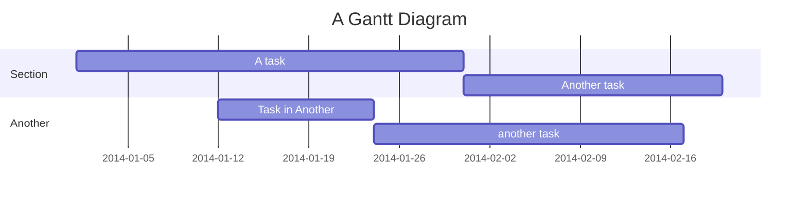

# Custom elements
## React components  
#### Result: 
import { Highlight } from "@site/components/Highlight/Highlight.tsx"

<Highlight color="#25c2a0">Docusaurus green</Highlight> and <Highlight color="#1877F2">Facebook blue</Highlight> are my favorite colors.

#### Implementation:
```
import { Highlight } from "@site/components/Highlight/Highlight.tsx"

<Highlight color="#25c2a0">Docusaurus green</Highlight> and <Highlight color="#1877F2">Facebook blue</Highlight> are my favorite colors.
```
## PIWIK components usage 
#### Result:
import Button from "@site/components/Button"

<Button text="I'm stolen from UIComponents" />

#### Implementation:
```
import Button from "@site/components/Button"
<Button text="I'm stolen from UIComponents" />
```

## Docusaurus components usage
#### Result:
import Tabs from '@theme/Tabs';
import TabItem from '@theme/TabItem';

<Tabs>
  <TabItem value="apple" label="Apple" default>
    This is an apple 🍎
  </TabItem>
  <TabItem value="orange" label="Orange">
    This is an orange 🍊
  </TabItem>
  <TabItem value="banana" label="Banana">
    This is a banana 🍌
  </TabItem>
</Tabs>

#### Implementation:
```
import Tabs from '@theme/Tabs';
import TabItem from '@theme/TabItem';

<Tabs>
  <TabItem value="apple" label="Apple" default>
    This is an apple 🍎
  </TabItem>
  <TabItem value="orange" label="Orange">
    This is an orange 🍊
  </TabItem>
  <TabItem value="banana" label="Banana">
    This is a banana 🍌
  </TabItem>
</Tabs>
```
## Mermaid components usage 
#### Result:

#### Implementation:
```
mermaid
graph TD;
    A-->B;
    A-->C;
    B-->D;
    C-->D;
```

## Mermaid Gantt Diagram  
#### Result:

#### Implementation:
```
mermaid
gantt
    title A Gantt Diagram
    dateFormat YYYY-MM-DD
    section Section
        A task          :a1, 2014-01-01, 30d
        Another task    :after a1, 20d
    section Another
        Task in Another :2014-01-12, 12d
        another task    :24d
```

## Live code block 
#### Result:
```jsx live
function Clock(props) {
  const [date, setDate] = useState(new Date());
  useEffect(() => {
    const timerID = setInterval(() => tick(), 1000);

    return function cleanup() {
      clearInterval(timerID);
    };
  });

  function tick() {
    setDate(new Date());
  }

  return (
    <div>
      <h2>It is {date.toLocaleTimeString()}.</h2>
    </div>
  );
}
```

#### Implementation:
```
jsx live
function Clock(props) {
  const [date, setDate] = useState(new Date());
  useEffect(() => {
    const timerID = setInterval(() => tick(), 1000);

    return function cleanup() {
      clearInterval(timerID);
    };
  });

  function tick() {
    setDate(new Date());
  }

  return (
    <div>
      <h2>It is {date.toLocaleTimeString()}.</h2>
    </div>
  );
}
```


## Live code block 
#### Result:
#### Implementation:


## Live code block 
#### Result:
#### Implementation: